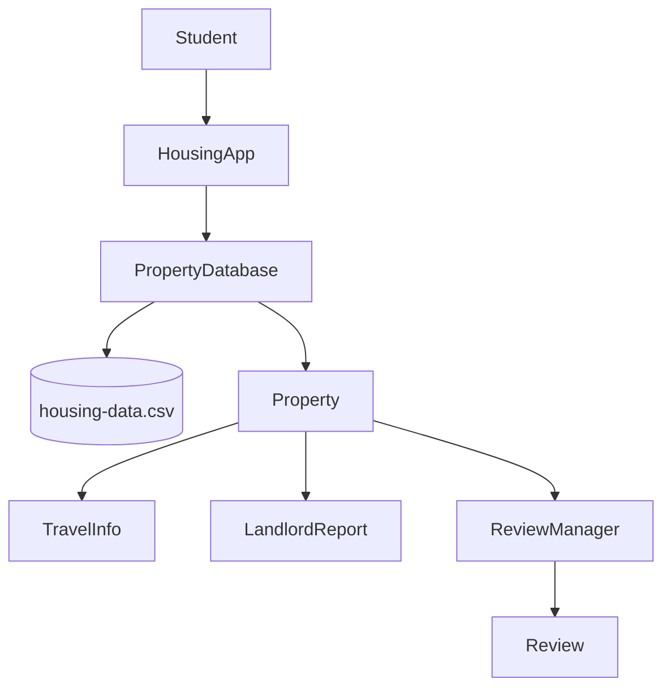

# Hokie Housing Tool

The Hokie Housing Tool is a Java console program that helps Virginia Tech students compare selected Blacksburg housing communities. Users can list properties, search by name, filter by starting rent or distance, and add temporary resident reviews. The program validates bad console input and keeps running instead of crashing.

## Eclipse setup — easiest method

Use the file named `HokieHousingTool_Eclipse_Ready.zip`.

1. In Eclipse, choose **File > Import**.
2. Choose **General > Existing Projects into Workspace**.
3. Select **Select archive file**, then choose the ZIP.
4. Eclipse should show `HokieHousingTool`. Check it and choose **Finish**.
5. Open `src/main/java/edu/vt/hokiehousing/HousingApp.java`.
6. Choose **Run As > Java Application**.

If Eclipse says Java 17 is missing, open **Window > Preferences > Java > Installed JREs** and add or select a Java 17 or newer JDK.

## Maven setup — alternative method

1. Install Java 17 or newer and Eclipse IDE for Java Developers.
2. In Eclipse, choose **File > Import > Maven > Existing Maven Projects**.
3. Select the `HokieHousingTool` folder and finish the import.
4. Open `src/main/java/edu/vt/hokiehousing/HousingApp.java`.
5. Choose **Run As > Java Application**.

If Eclipse does not download JUnit automatically, right-click the project, choose **Maven > Update Project**, and try again.

## Compile and run from a terminal

```bash
mvn clean test
mvn exec:java
```

The required one-line run instruction is: **Run `mvn clean test`, then run `mvn exec:java`.**

## Run the tests in Eclipse

Right-click `src/test/java`, then choose **Run As > JUnit Test**. The tests include normal and bad-input cases for the database, filters, review validation, duplicate reviews, CSV loading, value objects, and console input.

## Separate housing database

Housing records are stored in [`src/main/resources/housing-data.csv`](src/main/resources/housing-data.csv), not hard-coded in the Java classes. Edit the CSV to update properties. Keep all 20 columns and do not place commas inside a field.

`monthlyRent` means the lowest advertised base rent or installment visible when the data was checked. Different properties may lease by unit or by bedroom, so students must confirm current pricing and fees with the property. `Unknown` is used when a current value could not be verified. Travel times are planning estimates for the MVP and should not be treated as live map or bus data.

## Data sources and limitations

- [Foxridge official site](https://www.foxridgeliving.com/) lists its address, states that it is about two miles from Virginia Tech, identifies on-site bus stops, and links to current floor plans.
- [Foxridge floor plans](https://foxridgeliving.securecafe.com/onlineleasing/foxridge-apartments-0/floorplans.aspx) supplied the starting advertised rent stored in the CSV on September 21, 2026.
- [Union Blacksburg official site](https://www.unionblacksburg.com/) lists its address and management branding.
- [Union Blacksburg floor plans](https://www.unionblacksburg.com/blacksburg/union-blacksburg/student/) supplied the starting advertised base installment stored in the CSV on September 21, 2026.
- Other property URLs are included so the group can verify and replace `Unknown` fields before presenting. The app intentionally does not invent landlord ratings.

Prices, availability, ownership, management, and routes can change. This class project is a comparison aid, not a leasing recommendation.

## System diagram




## Project scope

The MVP uses researched static data and in-memory reviews. Live maps, live Blacksburg Transit data, user accounts, permanent review storage, a website, and personalized rankings remain stretch goals.

## Suggested Git workflow

Each member should commit their own work in small pieces. Example commit sequence:

```text
Jovany: add HousingApp menu and input validation
Jovany: add TravelInfo model and display output
Glenn: add Property and PropertyDatabase filters
Glenn: add and verify housing CSV records
Ryan: add landlord and review classes
Ryan: add review validation and tests
Group: integrate classes and fix demo issues
Group: add README diagram and presentation
```

Do not copy these as fake historical commits. Use them as a plan for real work completed by each teammate.

## Team responsibilities

- Glenn: `Property`, `PropertyDatabase`, and property research
- Jovany: `HousingApp`, `TravelInfo`, and transportation research
- Ryan: `LandlordReport`, `Review`, and `ReviewManager`
